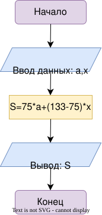

# Домашнее задание

## Условие задачи
Написать и отладить программу вычисления силы тока по
известным значениям напряжения и сопротивления электрической
цепи.

---

## 1. Алгоритм и блок-схема

### Алгоритм
1. **Начало.**
2. **Задать исходные данные:**
   * `U`- напряжение
   * `R`- сопротивление
3. **Вычислить заработок:**
   * Рассчитать силу тока по формуле: `I=U/R`.
4. **Вывод данных:**
   * Вывести значение `I` на экран.
5. **Конец.**
### Блок-схема

[](https://viewer.diagrams.net/?tags=%7B%7D&lightbox=1&highlight=0000ff&edit=_blank&layers=1&nav=1&page-id=7_pry1ZoyeZuHqAwxt9I&dark=auto#R%3Cmxfile%3E%3Cdiagram%20name%3D%22%D0%A1%D1%82%D1%80%D0%B0%D0%BD%D0%B8%D1%86%D0%B0-1%22%20id%3D%22vYnkC4cLGcOmQwEQ1W34%22%3E7Zhtb5swEMc%2FDdJWqRXYPOVlk3TdpE6qFqnbXrpwBGsGI%2BM0ZJ9%2BBkx4Spc0a7pV64s49vl8OPf7HzgYeJYU14Jk8WceAjOQuRQ0NPDcQMhSH2XIyBJ6htJjQX82RlNbVzSEvOcoOWeSZn1jwNMUAtmzESH4uu8WcTbexiIgDEbWrzSUcW31kdfaPwJdxs2FLHdSzySkcdYbz2MS8nXHhK8MPBOcy7qXFDNgZWaavNTrPjwyu92YgFQesoDMgy888eTdmuX0LkTx4ubmfEcUbcrlpsmB4Ks0hDKMZeDpOqYSFhkJytm1QqpssUyYntbOtyBoAhKENkeUsRlnXFQhMVihA56y51LwH9CZmbgeJm65gqdS47fKcb2tB8JWelvG3DQm87Kdmoa6iO81fdVOq%2FZKLwIhoej8PJ2ha%2BBqj2KjXOIORFsTW7fArYZiE8XT481gnmh5LbehWySqo6k8gRA6hJDSVlZ2lRdhDBhfCpKonGUdCr25Dp59QKvYn9Jcld2WZQFNZe5gGxLwo2AXWzfw4T46mG3VTpEmWba28tKdFvW8aZUEplXrGPiyZGGgWfFsCvAGCrCdngKQeSoF4KfVqLkf6QBYFEUo2AksdO9d56BiXKgvzzlTKZ%2B%2BszA%2B95z3Z8%2BXe3uQe7dffcg%2FVe7t%2F7r66oIa1WBVXIuXKizsngqu89offpcdLPVd0KmguS%2F12LPtU7HRPwHCwaFwFyy%2BEgHsP%2BR0oEIaXpZnQTUKGMlzGuzkqO%2BmXRiowkZEY%2FDVWEXrjIKVeNjqBQoqv5VhLhw9%2Bt6ZmRf6CtVgowdj1nvRORqDAEYkfeinrMPT6eM8Ny98a%2BI%2FjrC6qsoU2XQcMk5TmffPmrelrQ2M8OB45Ax0UjPTq34XCE0u9jxnFYwlyFGoSnXbdB0vRP8JQnwT2N8SGBreiP5AYMPDxIkFNnkT2CsQGB7%2BwTteYKMDzYkF1rw5eVPYP60we%2FhgO15ho2PZ0QpTw%2FYNVe3evsTDV78A%3C%2Fdiagram%3E%3Cdiagram%20id%3D%227_pry1ZoyeZuHqAwxt9I%22%20name%3D%22%D0%A1%D1%82%D1%80%D0%B0%D0%BD%D0%B8%D1%86%D0%B0-2%22%3E5VjJbtswEP0aHV1opeVjbCdpgBYIanRJb4w0WlpaFGh669eXkoam5Dixk8ppil4ozeNwm5n3RMjyJvPNtaBl9pHHwCzXjjeWN7Vc1%2FG9kXpUyFYjvt8gqchjxAwwy38BgjaiyzyGRcdRcs5kXnbBiBcFRLKDUSH4uuuWcNZdtaQprmgbYBZRBg%2FcvuaxzBo0dIcGfw95mumVHYInnlPtjBMvMhrzdQvyLi1vIjiXzdt8MwFWRU%2FHpRl39UjvbmMCCnnKAF96i9Vgze6%2BR5LQlcdT%2F8vA8ZppIE73D2zmRWjBlyKCpyZDP7nV0aumnaFZ8EI9xtFSrKDakqMMwZdFXFu27roGPgcptujBhcx4ygvKPnBeIvgDpNxirdCl5ArK5Jxhb8ILiZ2OivJ4IanQQKhsKOKWhTVFRQryibOFjd%2BKsiWebZdCVfx6z64tgFGZr7rBpFiE6c7P5Em9YKqek7bHk2SCb4JbRWWd5RJmJa0zuFZs7QYNnW9B5GqLIA7EklR2ztiEMy7qJTxw4gCGdYwF%2FwmtnhEZepTs4tuOm8r1aFq1Y9tSi4RD%2Fa7acd1e4iAQEjat4z0Md9bino9EWxueOpp8OMsg0ADq0YDoUf3nyO%2BRWuG%2FSC11SrH9Vu3gXaDNO9xQbUw3HWuL1omUdNy%2BOYlDb3mu8mOKxid7ReMP94qm2SuO26sbE%2FUXl1J4Ct3V96WsXpUXZQwYTwWdq2iWLUp3%2BlpcP6YO9dw3xUJ9i3Ul5BvQuT5BKGIKYRIdEgoShXCfPCoUdTt2URaqVtHKxhejG1PdKj0Z162quAvl%2BdlyJ596k5NwX06CvcoIyNnkhPQoJ6O3IScvFYizfOEd%2B3BNvM4XffRfU7xh7QOi1wy%2BeT32%2BvbZ2Gufkt%2B3fGO7aGWmUdugzht5vbua554tPUGP4qrvJX9bXd%2FUZW3U913tz%2FLtPo%2BO9nE6HuFdkiRudFAdY3JPgoO8u1EPdX%2B56u%2F%2BcpRifvh8iinT%2FMVorrzmZ5B3%2BRs%3D%3C%2Fdiagram%3E%3C%2Fmxfile%3E)
## 2. Реализация программы
```c
#include <stdio.h>
void main() {
    double U, R, I;
    U=7.3, R=2.5;
    I=U/R;
    printf("%.2lf",I);
}
```
## 3. Результат работы программы
2.92
## 4. Информация о разработчике
Гаврилова Анна, бИД-262
